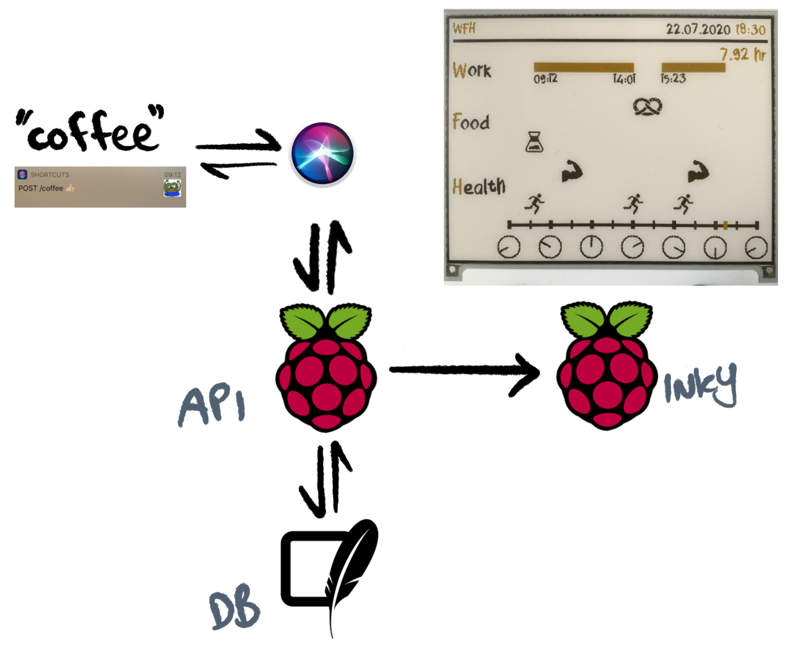

# Work From Home (WFH) Monitor

<p align="center">
    
    
    
    
    
    
</p>

A monitor for tracking critical Work From Home (WFH) actions grouped as follows:

- **W**ork
- **F**ood
- **H**ealth



##
### Prerequisites

WFH requires at minimum the following hardware setup.

- [Raspberry Pi](https://www.raspberrypi.org/) (currently using both 3B+ and Zero W)
- [Inky wHAT](https://shop.pimoroni.com/products/inky-what) (ePaper/eInk/EPD)

## 
### Quick Start

WFH requires a running API, a scheduled trigger for updating Inky wHAT and an (optional) iOS shortcut for simplifying requests.

Installation of the wfh package can be done as follows.

```bash
$ python3 setup.py install --user
```

#### API

The minimal Flask API is only necessary for connecting clients to the underlying sqlite database. The main interaction is registering actions by the user (POST `/:action`) and retrieving "today" by the Inky wHAT (GET `/today`).

A successful **development** API will output the following.

```bash
$ python3 wfh/app.py

2020-07-26 19:52:02,338 - root - INFO - [client] connecting -> actions.sqlite
2020-07-26 19:52:02,344 - root - INFO - [client] checking table -> actions
 * Serving Flask app "app" (lazy loading)
 * Environment: production
   WARNING: This is a development server. Do not use it in a production deployment.
   Use a production WSGI server instead.
 * Debug mode: off
2020-07-26 19:52:02,521 - werkzeug - INFO -  * Running on http://mango.local:8080/ (Press CTRL+C to quit)
```

#### Inky wHAT

The eInk display is updated only on workdays based on simple fixed values defined in `./wfh/display/constants.py`. The default settings (8am to 8pm) are pasted below.

```python
INTERVAL = 15
START_TIME = 8
END_TIME = 20
```

A successful running inky scheduler job will output the following.

```bash
$ python3 wfh/trigger.py

2020-07-26 19:50:46,333:INFO:Adding job tentatively -- it will be properly scheduled when the scheduler start
2020-07-26 19:50:46,338:INFO:Added job "update_inky" to job store "default"
2020-07-26 19:50:46,339:INFO:Scheduler started
2020-07-26 19:50:46,340:DEBUG:Looking for jobs to run
2020-07-26 19:50:46,344:DEBUG:Next wakeup is due at 2020-07-27 08:00:00+02:00 (in 43753.659445 seconds)

```

#### iOS Shortcut (optional)

A basic shortcut for issuing voice commands as POST requests to the running API server of choice can be found [here](https://www.icloud.com/shortcuts/fb864ab97f8e464bb71e21b9a0073b23).


##
### Contributors
<a href="https://github.com/jfri3d/wfh/graphs/contributors">
  
</a>
